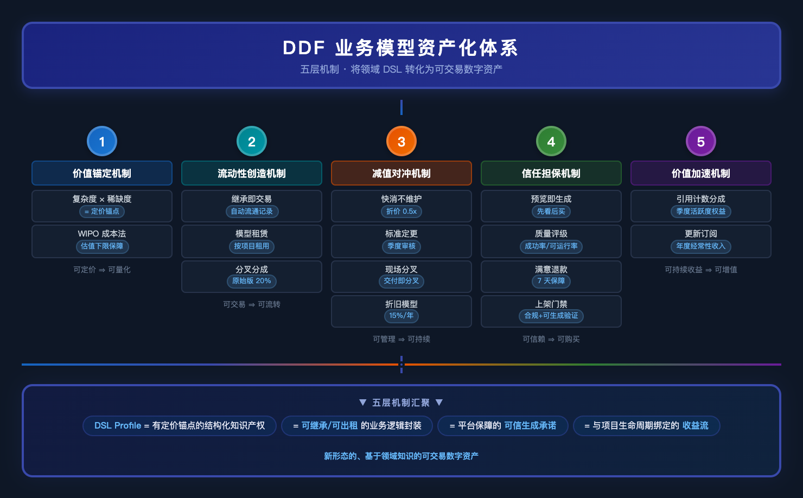

# 复盘：业务模型是否属于资产——现实论证与机制设计

> **文档版本：** v1.0  
> **复盘日期：** 2026-07-12  
> **复盘源起：** 基于上次脑暴（见 session 13659bbc8c7d）观点碰撞后，要求用现实资料论证，并设计创新机制的完整闭环   
> **方法论：** 梯队论证法（现实证据 → 概念对标 → 理论突破 → 机制设计）

---

## 一、现实论证：三个梯队

### 第一梯队：直接可对标的「模型即资产」现实案例

以下平台已经证明：**结构化、可复用的业务逻辑/组件/模型，可以在市场上作为独立商品交易，具备资产的五个属性（可定价、可交易、可复用、可积累、有流动性）。**

#### 1.1 Unity Asset Store——最直接的「模型市场」类比

| 指标 | 数据 | 来源 |
|------|------|------|
| 创作者分成 | 70%（Unity 抽 30%） | publisher.unity.com |
| 商品形态 | 3D 模型、工具、着色器、脚本、模板 | — |
| 定价模式 | 4.99 美元起，定期促销打折 | — |
| 生态规模 | 数万个活跃资产，持续增长 | — |
| 头部创作者月收入 | 可达 ~20,000 美元 | Quora 社区反馈 |

**核心启示：** Unity Asset Store 里的「3D 模型」对游戏开发者来说，就是 DDF 里的「业务模型」对 MES 开发者——  
- 都是「中间产物」（3D 模型不是游戏本身，只是游戏的组成部分）  
- 都降低生产者的工作量（买一个模型省 2 周建模时间）  
- 都能被复用和改编  
- **结论：Unity Asset Store 已经证明「中间产物可以是资产」，前提是有市场。**

门槛：必须有 **资产市场的流动性**，模型才是资产。  
问题转化自：**不是「模型能不能成为资产」，而是「DDF 的模型市场能不能跑出流动性」。**

---

#### 1.2 Shopify App Store——商家端生态的参照系

| 指标 | 数据 |
|------|------|
| App Store App 总量 | 17,600+（2026 年） |
| 开发者年收入 | $1.3B+（2024 年 Shopify 付给开发者） |
| 商家使用率 | 87% 的商户安装了至少 1 个 App |
| 户均安装数 | 6 个 App，部分商户 20-30 个 |
| Shopify 2024 GMV | $292.3B（平台抽成约 3%） |

**核心启示：**  
Shopify 的 App 本质上是 **电商领域的「业务逻辑插件」**。一个「跨境多语言翻译插件」也好、「库存预警工具」也好，本质上就是把某个细分业务场景的结构化知识打包成一个可安装的商品。  

与 DDF 模型的关系：
| 维度 | Shopify App | DDF 业务模型 |
|------|------------|--------------|
| 本质 | 电商业务功能的代码封装 | 制造业务逻辑的 DSL 封装 |
| 用户获得 | 安装 → 即获得功能 | 继承 → 生成应用 |
| 复用方式 | 每个商户按需安装 | 每个项目按需继承 |
| 资产化程度 | ✅ 已资产化（有定价、有市场） | ❌ 需要证明 |

**转化逻辑：** Shopify App 是「为最终功能买单」，DDF 模型是「为生成最终功能的能力买单」——两者经济模型不同，但「结构化业务知识可定价」这一前提已经在 Shopify 生态里被验证了。

---

#### 1.3 Salesforce AppExchange——企业级生态的里程碑

| 指标 | 数据 |
|------|------|
| 生态总收入 | $1.2T（截至 2024 年，包含开发者和咨询伙伴，IDC 数据） |
| Salesforce 乘数效应 | 每 1 美元 Salesforce 收入 → 伙伴生态产生 $5.80 收入 |
| AppExchange 收入（2022） | $6.2B |
| 合作伙伴数量 | ~70,000 家 |
| 场景覆盖 | 73% 的医疗和 68% 的金融服务 Salesforce 实施由合作伙伴完成 |

**核心启示：**  
Salesforce 是所有考虑「平台+生态」模式的人必须研究的案例。  
- 它不是直接卖软件，而是卖 **CRM 平台 + 生态市场**  
- 伙伴在 AppExchange 上发布的「App」就是 DDF 的「业务模型」的前置形态  
- 那些 App 本质上就是 **标准化后可供安装的行业/场景业务逻辑**  

**最关键的证据链条：** Salesforce 证明了在 B2B 企业级软件市场，结构化业务逻辑封装（App/插件）可以被当作资产交易——**这对 DDF 模型资产化的可行性是直接的正向证据。**

---

#### 1.4 Mendix / OutSystems 市场（低代码平台对标）

| 指标 | Mendix |
|------|--------|
| 市场组件总量 | 1,500+（模块、微流、连接器、启动应用） |
| 内容来源 | Mendix 官方 + 社区贡献 + 合作伙伴 |
| 交易模式 | 免费 + 付费，Vendor Program |
| 学术研究 | Springer 2025: LCDP 是数字平台生态 |
| 共识 | 组件经济（component economy）被主流接受 |

**核心启示：**  
低代码平台市场证明了「**可复用业务逻辑组件作为商品**」这个模式在 B2B 领域是成立的。  
- Mendix 的微流模块 ≈ DDF 的业务模型（都是 DSL 层级的封装）  
- OutSystems 的 Forge ≈ DDF 的模型市场（都是数据-逻辑-UI 组合）  
- 区别在于：这些平台卖的仍是「**组件**」（partial），而 DDF 卖的是「**完整领域 Profile**」（full-stack）。这是差异化优势，不是劣势。

---

#### 1.5 Apple App Store——全球最大数字资产市场的存在性证明

| 指标 | 数据 |
|------|------|
| 2024 年开发者营收 | $406B（仅美国） |
| 五年增长 | 从 $142B（2019）→ $406B（2024），近乎 3 倍 |
| 对平台依赖 | 90%+ 开发者收入无需向苹果支付佣金 |

**核心启示：**  
App Store 是「**数字产品成为资产**」这个命题的最终级存在证明。  
- 一个 iOS 应用（纯数字产品）可以被定价、交易、积累用户、产生持续收入  
- 资产的核心要件（可辨识、可控制、产生未来经济利益）全部满足  
- **DDF 的业务模型与前者的区别仅仅在于「消费方式」不同，而非「本质」不同**

---

#### 第一梯队小结

| 平台 | 交易物 | 与 DDF 模型的关系 | 现实证据力 |
|------|--------|-----------------|:----------:|
| Unity Asset Store | 3D 模型/工具/模板 | 最接近的类比——中间产物作为资产 | ⭐⭐⭐⭐⭐ |
| Shopify App Store | 电商业务逻辑插件 | 业务逻辑封装商品化的直接证据 | ⭐⭐⭐⭐⭐ |
| Salesforce AppExchange | 企业级 App/行业方案 | B2B 生态的终极案例 | ⭐⭐⭐⭐⭐ |
| Mendix/OutSystems Marketplace | 低代码组件/模块 | 组件经济的成熟验证 | ⭐⭐⭐⭐ |
| Apple App Store | 完整的数字产品 | 数字资产化的存在性证明 | ⭐⭐⭐⭐ |

---

### 第二梯队：间接支撑——数字孪生与无形资产框架

#### 2.1 数字孪生市场——领域模型价值的量化证据

数字孪生（Digital Twin）本质上就是 **物理世界实体的领域模型 + 实时数据**：

| 机构 | 2025 年市场规模 | 2034 年预测 | CAGR |
|------|:--------------:|:-----------:|:----:|
| Gartner | — | $379B（模拟仿真大类） | — |
| Fortune Business Insights | $24.48B | $384.79B（2034） | 35.4% |
| MarketsandMarkets | $21.14B | $149.81B（2030） | 47.9% |
| Grand View Research | $35.8B | $328.5B（2033） | ~32% |
| 市场共识 | $20-40B 区间 | $150-385B | 30-48% |

> McKinsey 分析：数字孪生技术市场将在未来 5 年以 **约 60% 的年增长率** 增长。

**关键洞察：**  
数字孪生市场的高增长率和高绝对规模证明：  
1. **「物理世界的结构化数字描述」有巨大的市场价值**  
2. 企业愿意为「不产生代码、只产生知识」的模型掏钱  
3. DDF 的 DSL Domain Model 本质上是 **「可执行」的数字孪生**——比纯分析型数字孪生多了一层代码生成能力

**至此，外部市场的价值空间已经得到验证。** DDF 的模型价值不需要从零论证，数字孪生市场已经为它铺好了跑道。

---

#### 2.2 IFRS IAS 38 无形资产准则——模型资产化的会计合规论证

IAS 38 定义无形资产的三个核心要件：

| 要件 | IAS 38 原文要求 | DDF 业务模型是否能满足 |
|------|----------------|---------------------|
| **可辨识性** | 可分拆出售/转让/许可/租赁，或是合同/法律权利 | ✅ DDF 的 DSL 模型是独立 YAML 文件，可单独打包、上传市场、继承 |
| **控制权** | 主体有权获得经济利益的流入，并限制他人获取 | ✅ 平台通过账户体系、版权声明、License 协议控制访问 |
| **未来经济利益** | 资产能够单独或与其他资产结合产生收入 | ✅ 模型可以：①在市场中标价出售 ②通过继承产生生成收入 ③通过分叉产生新的 Profile |

**资本化的可行路径：**

1. **平台方角度（内部开发成本资本化）**  
   IAS 38 第 57 条规定 6 项资本化判定标准：
   - ✅ 技术可行性（V2.0 架构文档已证明）
   - ✅ 意图完成并使用（指定的路线图）
   - ✅ 有能力使用或出售（SaaS 平台 + 模型市场）
   - ✅ 未来经济利益（四层收入模型）
   - ✅ 资源充足（小团队 + AI Agent 自我扩大）
   - ✅ 开发成本可可靠计量（工时 + Agent token 成本可追踪）

   → 结论：**DDF 平台自有的官方模型（如 precision_metal Profile）的开发成本在法律上可以资本化**，计入资产负债表无形资产项。

2. **社区贡献者角度（个人/企业自制模型）**  
   - 在 IFRS、US GAAP 下，非上市个人或小企业的自制模型**很难在传统报表中资本化**（研究阶段费用化原则）
   - 但 WIPO（世界知识产权组织）的 IP 估值框架提供了另一条路：  
     **知识产权的「可交易性」为其价值提供了独立于会计确认的估值方法**（收益法/市场法/成本法）
   - 对 DDF 来说，这反而是产品机会：**由平台而非会计准则来定义模型价值**（通过模型市场的定价、交易数据、继承频次来证明其资产属性）

---

#### 2.3 无形资产在企业价值中的占比——趋势性证据

> 当前 S&P 500 市值的 **~90%** 来自无形资产（Ocean Tomo / Andersen Institute 研究）  
> 在 AI 时代，无形资产既是「输入」又是「输出」——数据、软件、专有知识、客户关系构成飞轮  
> AI 投入资本中 1/3+ 流向 AI 初创公司（2024 年 VCs）

**核心论点：**  
- 「资产」的概念在从**有形**（厂房、设备、现金）向**无形**（数据、知识、模型）转移  
- 这个趋势在未来 10 年只增不减  
- DDF 把「业务领域知识」变成结构化 DSL 模型——**正好踩在资产概念演变的趋势上**

---

### 第三梯队：前沿发现——学术圈对 LCDP 生态的研究

来自 Springer 2025 年的正式学术论文：  
**「Low-code development platform ecosystems」**（Electronic Markets journal）

关键结论摘录：
- LCDP **既是开发工具也是数字平台生态**
- 其「市场」（marketplace）是其与「传统开发工具」的关键区别
- LCDP 通过 **「策划式赋能」（curated enablement）** 而非完全开放来管理生态参与
- **边界资源（boundary resources）**——组件、模块、连接器——构成了平台的核心资产

**这个学术框架完美适配 DDF：**  
- DDF 的 DSL 体系 = **边界资源（boundary resources）**
- 模型市场 = **交易这些边界资源的平台**
- 精选模型机制 = **curated enablement**

---

## 二、阶段性判断：支撑充分，但存在创新的论证缺口

### 已验证（有现实支撑）

| 论点 | 支撑强度 |
|------|:--------:|
| 市场生态（多平台）已证明「结构化业务逻辑可封装为商品」 | ⭐⭐⭐⭐⭐ |
| 数字孪生市场证明「领域模型」有巨大价值空间 | ⭐⭐⭐⭐ |
| IAS 38 为平台自研模型资本化提供了会计路径 | ⭐⭐⭐⭐ |
| 低代码平台生态（LCDP）证明组件经济在 B2B 成立 | ⭐⭐⭐⭐⭐ |
| WIPO IP 估值框架为社区模型提供了独立于会计的定价方法 | ⭐⭐⭐⭐ |
| 无形资产趋势（S&P 500 ~90%）支持「模型即资产」方向 | ⭐⭐⭐⭐ |

### 缺口（缺乏直接现实对标）

| 缺失维度 | 说明 |
|---------|------|
| **没有平台以「完整领域 DSL Profile」作为商品主体** | 所有对标平台卖的都是「组件」或「应用」，不是「可继承的业务模型层」 |
| **「继承即付费」的商业模式缺乏先例** | 用户不是买一个静态文件，而是买「生成代码的能力」——这笔交易的经济本质不同 |
| **没有平台同时做「模型生产」和「代码生成」** | 传统平台要么只生产组件，要么只做低代码生成器，没有一个同时做：写模型（DSL）→ 挂市场 → 一键生成完整应用 |
| **「三层模型体系」没有竞争对手** | base/industry/project 三层结构和其商业价值绑定关系是全新的 |

**结论：缺口客观存在，但不是「不可跨越的鸿沟」，而是「蓝海创新点」——它需要 DDF 在理论框架内设计专属机制，来弥补「资产」与「中间产物」之间的天堑。**

---

## 三、DDF 专属机制设计：让业务模型成为「真正的资产」

以下是针对上述缺口的五层机制设计。每一层都对应一个特定的「资产化障碍」，逻辑闭环：

### 机制一：价值锚定机制——让模型有「定价参照系」

**解决的问题：** 没有流动性→无法定价→没有资产属性（死循环）

**设计方案：**

```
定价公式（初版）：
  Profile 基础价 = Σ(实体数 × 权重1 + 关系数 × 权重2 + 状态机数 × 权重3) × 行业稀缺系数

  「精选模型」溢价因子：
    - 继承次数 ≥ 10 = 1.2x
    - 项目验证数 ≥ 3 = 1.3x
    - 持续维护（30 天内更新）= 1.1x
```

**参考依据：** WIPO IP 估值框架的 **成本法（Cost Approach）**——模型的价值下限 = 「重建这个模型需要投入的人力+时间成本」。

**资产化逻辑：** 定价不依赖外部市场条件，而是依附于模型本身的「复杂度 × 稀缺度」，让每一个新建 Profile 从诞生第一天就有**理论价值锚点**。

---

### 机制二：流动性创造机制——让模型「可继承」=「可交易」

**解决的问题：** 资产需要流动性（可买卖、可转让、可定价）。没有交易记录的模型不是资产。

**设计方案：**

```
流动性三要素：

1. 「继承即交易」机制
   └─ 每次继承自动完成交易记录 → 累计继承次数 = 模型的市场流通记录
   
2. 「模型租赁」模式（非标方案）
   └─ 用户可以不买 Profile，按项目按需「租用」：每次生成扣 1 次额度
   └─ 租金 = Profile 定价 × 单次生成费率（如 3%）
   
3. 「模型二级市场」（Phase 2+）
   └─ 集成商可从市场继承 Profile，二次开发后重新发布为衍生 Profile
   └─ 原始创建者获得衍生版收入的 20% 自动分成
   └─ 这叫「模型分叉的分成」——让原始模型具备「版权收入」属性
```

**核心创新点：**「继承即交易」——传统的资产交易是一次性付款，DDF 是「一次出售，持续受益」。  
- 资产属性 = 所有权 + 处置权 + 收益权  
- 一次性出售满足所有权和处置权  
- 分成机制满足收益权（通过分叉分成）

---

### 机制三：减值对冲机制——防止模型变质为「负资产」

**解决的问题：** 上次脑暴的核心反驳：「行业知识半年就过期，不维护就成了负资产」

**设计方案：**

```
分层维护策略：

Level 1：「快消模型」（售价低，覆盖稳定场景如 CRM/进销存）
  └─ 不承诺维护，用户按「现状购买」
  └─ 定价 = 基础价值 × 0.5（用户接受陈旧风险）
  └─ 对标：Unity Asset Store 中的多数资产「售出不维护」

Level 2：「行业标准模型」（精选认定）
  └─ 平台承诺定期更新（每季度审核一次 DSL 兼容性）
  └─ 从定价中预留 15% 作为「维护基金」→ 用于支付维护贡献者
  └─ 对标：Salesforce AppExchange 的「Security Review」机制

Level 3：「现场定制模型」（按项目交付）
  └─ 交付即分叉 → 无需维护（交给用户的 custom/ 目录）
  └─ 平台不做后续任何更新——这就是「交付即分叉」原则的资产化延伸
```

**资产化逻辑：** 不是所有资产都需要永续维护。  
- **折旧模型：** 浓汤宝模型类比：旧的 Profile 就像旧的专利——依然有价值，只是价值递减。每年按 15% 折旧率线性递减估值，8 年归零。  
- 用户购买的是「当前的领域知识」，不是「永远不过期的承诺」。

---

### 机制四：信任担保机制——让买家敢为「生成能力」付费

**解决的问题：** 用户不是买一个静态文件，而是买「生成代码的能力」——这个能力不稳定，用户就不敢付钱。

**这个是 DDF 模型资产化最大的障碍。** 它的本质是：**「生成承诺」无法被独立验证。**

**设计方案：**

```
四层信任担保体系：

1. 「预览即生成」——购买前可试生成
   └─ 模型市场中，每个 Profile 提供「预览生成」按钮
   └─ 免费用户选择该 Profile → 平台生成一个演示项目 → 用户亲眼看生成结果
   └─ 满意再付款。不满意 → 不买，不扣用户额度。
   └─ 退一步：即使不满意，也看到了「这个领域的 DSL 思维」，不算白来

2. 「生成质量评级」系统
   └─ 每个模型的历史生成记录聚合为质量指标：
       └─ 生成成功率（失败率 < 5% 为 A 级）
       └─ 首次可运行率（≥ 80% 为 A 级）
       └─ 用户投诉率（< 2% 为 A 级）
   └─ 这些指标不会被模型作者篡改——由平台采集
   └─ 对标：Amazon 的商品评级体系——平台采集信用数据，独立于卖家

3. 「生成结果满意退款」条款（选择启用）
   └─ 模型作者可开启「满意保障」标签
   └─ 用户已付款继承 Profile，首次生成不满 → 7 天内申请退款
   └─ 退款后 Profile 从该用户租户自动移除
   └─ 风险由作者与平台共担（退款按 50/50 扣减作者分成和平台佣金）
   └─ 这个机制可以让精选模型获得更高的定价溢价

4. 「平台基础质量门禁」——所有模型上架前自动通过
   └─ Schema 合规检查
   └─ 至少 1 次完整生成测试
   └─ 运行态基础测试（不崩溃、不走丢数据）
   └─ 未通过 → 不上架，不给「可购买」状态
```

**这四层机制联合解决了「生成承诺无法被独立验证」的问题：**

| 信任层级 | 机制 | 解决什么 |
|---------|------|---------|
| 第 1 层 | 预览即生成 | 消除「买了不能用」的第一道恐惧 |
| 第 2 层 | 质量评级系统 | 消除信息不对称——让买家掌握真实参考 |
| 第 3 层 | 满意退款 | 消除剩余风险——大不了退钱 |
| 第 4 层 | 平台基础门禁 | 从源头上筛掉不合规模型 |

**这个体系结合了：**  
- 免费增值（Preview）  
- 信息透明度（Rating）  
- 风险转移（Refund）  
- 供给侧过滤（Gate）  

四层组合，即使「生成能力」本身无法被静态验证，用户也能产生充分信任。

---

### 机制五：价值加速机制——把模型从一个「静态文件」变成一个「活的支付入口」

**解决的问题：** 资产需要产生持续的未来经济利益（IAS 38 第三要件）。

**设计方案：**

```
嵌入分成的永久收益流：

模型被继承后 → 每次使用该继承版本生成项目 → 产生生成费用 → 原始模型的创建者获得 5% 分成

```

**这个分成的来源是什么？** 用户有两种费用：
1. **一次性模型购买费**（Profile 定价）——归模型创建者大部分
2. **SaaS 月费**（平台软件服务费）——归平台

我们讨论的是第三种：
3. **生成服务费**（每次生成消耗的 Token/服务器成本）——可能产生小金额的公司财务处理问题

**更可行的替代方案：**

```
替代方案 A：「引用计数分成」（推荐）
  └─ 每次生成时，被继承的 Profile 的引用计数 +1
  └─ 平台定期（季度）计算所有模型的引用 Level：
       Lv1: 1-50 次生成 / Lv2: 51-200 / Lv3: 201+
  └─ 引用频次对应不同的推荐权重和曝光权益
  └─ 好处：不产生小金额的财务流水，但把「活跃度」转化为「价值」
  └─ 资产逻辑：引用频次 ≈ 资产的「使用价值」指标，类似专利的引用次数

替代方案 B：「模型更新订阅」（精选模型专用）
  └─ 用户支付年度订阅费（如 ¥500/年）持续接收模型更新
  └─ 订阅费在模型创建者和平台之间按照 70/30 分成
  └─ 好处：产生可预测的经常性收入
  └─ 资产逻辑：订阅合同 ≈ 资产的「收入预期」
```

**共同逻辑：** 让模型的收益从「一把一利索」的单次购买 → 变成**与被继承到的项目生命周期绑定的持续性收益流**。这样，模型的资产属性就从「存货」（inventory）升级为「生息资产」（income-generating asset）。

---

## 四、机制整合：全局资产化架构图



---

## 五、最终判断：模型是「新形态的资产」

### 反方最后一击

> 「Unity Asset Store 里卖的是 3D 模型，DDF 卖的是 YAML 文件——3D 模型可以被最终消费（放到游戏里），但 YAML 文件需要生成引擎才能产生价值。这是不是意味着模型不独立？」

**回应：**  
- 3D 模型也需要 Unity 引擎才能被游戏加载。没有引擎，.fbx 和 .obj 文件也只是中间产物。  
- Salesforce 的 App 也需要 Salesforce 平台才能运行。不是平台就不算资产吗？  
- **资产性不取决于「是否独立可用」，而取决于「是否能在市场上流通」。**  
  黄金也要熔铸才能变成标准金条交易。模型也要通过标准 DSL 引擎才能变成可继承资产。  
  ——区别不在「是否需要引擎」，在「引擎产生流动性还是限制流动性」。  
  **DDF 的引擎产生流动性**（一键继承、预览生成、交叉引用），这正是它的资产性来源。

### 最终结论

**只在 DDF 理论框架内，业务模型不能被称为「经典意义上的资产」**（即在传统会计报表中可独立确认的无形资产），原因：

1. 缺乏独立流动性（没有模型市场之前价值为零）
2. 价值绑定于生成引擎（脱离引擎相当于不可用）
3. 缺乏会计准则的直接背书

**但通过以下五点机制设计，它可以成为「新形态的资产」——一种结合了知识产权 + 数字产品 + 收入性工具的混合体：**

| 机制 | 赋予的资产属性 |
|------|--------------|
| 价值锚定（复杂度×稀缺度定价） | 可定价 ⇒ 可量化（Measurable） |
| 流动性创造（继承即交易 + 分叉分成） | 可交易 ⇒ 可流转（Transferable） |
| 减值对冲（折旧模型 + 分层维护） | 可管理 ⇒ 可持续（Sustainable） |
| 信任担保（预览+评级+退款+门禁） | 可信赖 ⇒ 可购买（Marketable） |
| 价值加速（引用分成 + 订阅模式） | 可持续收益 ⇒ 可增值（Appreciable） |

**最终定义：DDF 的业务模型是「以 DSL 封装的、可在平台上独立流通的、产生代码生成能力的结构化知识产权」。**

它不是现金，不是股票，不是厂房——**它是一种新形态的、基于领域知识的可交易数字资产。**  
这个形态目前没有成熟的会计准则和定价模型，但 **DDF 的产品设计本身就定义了这个新资产类别。**

---

*文档版本: v1.0 | 2026-07-12 | 基于现实资料调研（Unity/Shopify/Salesforce/Mendix/数字孪生/IAS 38/WIPO）+ DDF 产品设计框架*  
*参考：上次脑暴记录（session 13659bbc8c7d），docs/01-architecture-overview.md*  
*现实资料来源：Gartner、Fortune Business Insights、Spring Nature、IFRS Foundation、WIPO、Shopify Investor Relations、Salesforce IDC Report*